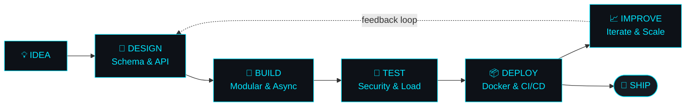
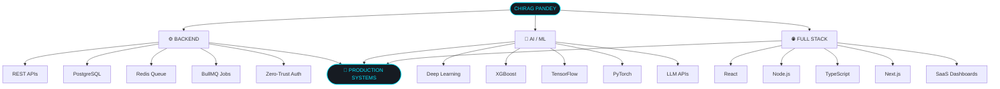

<div align="center">


<a href="https://github.com/Chirag240105">
  
</a>

<br/>

<p align="center">
  
  
  
</p>

<p align="center">
  <a href="https://github.com/Chirag240105"></a>
  <a href="https://www.linkedin.com/in/chirag-pandey-b54499328/"></a>
  <a href="https://leetcode.com/"></a>
  <a href="mailto:pandeychirag651@gmail.com"></a>
</p>

</div>

<br/>

## ⚡ `$ whoami`

```text
┌──────────────────────────────────────────────────────────────────────────┐
│  DEVELOPER_PROFILE  :  Chirag Pandey                                     │
│  ------------------------------------------------------------------      │
│  EDUCATION  :  B.Tech CSE @ KIET Group of Institutions (2024 – 2028)     │
│  CORE_STACK :  Node.js • Python • C++ • TypeScript • PostgreSQL • React │
│  DOMAIN     :  MERN Stack • Backend Systems • ML / LLM Integration       │
│  STATUS     :  🚀 Actively seeking Software Engineering internships      │
│                                                                          │
│  CURRENT_DIRECTIVES                                                     │
│   ├── ⚙️  High-throughput async backends (FastAPI / Express / BullMQ)   │
│   ├── 🗄️  Advanced database architecture & transaction safety           │
│   ├── 🤖  Production ML / LLM pipelines (PyTorch / LLaMA)               │
│   └── 🔐  Zero-trust API security & distributed auth (RS256 / JWT)      │
└──────────────────────────────────────────────────────────────────────────┘
```

<div align="center">



> *"Don't just make it work. Make it scalable, secure, observable, and maintainable."*

</div>

---

## 🛠️ Tech Arsenal

<div align="center">

**💻 Languages**


**🎨 Frontend & Styling**


**⚙️ Backend, Microservices & Queues**


**🗄️ Databases & ORM**


**🤖 AI, Deep Learning & Data Science**


**☁️ Cloud, Infra & Dev Tools**


</div>

<br/>

### ⚡ Technical Capability Matrix

| Area | Specialized Expertise & Implementations |
|---|---|
| ⚙️ **Backend Engineering** | Scalable REST APIs, microservices, asynchronous task-queue processing, system design |
| 🗄️ **Database Systems** | ACID-compliant transactions, schema design, aggregation frameworks, caching strategies |
| 🔐 **API & Auth Security** | Zero-trust architecture, RS256 JWT, refresh-token rotation, rate limiting, RBAC |
| 🤖 **AI / ML & LLMs** | Deep learning pipelines, computer vision, XGBoost regression, LLM function calling |
| 🔁 **Automation & Queues** | BullMQ workers, distributed caching with Redis, background jobs, retry logic |
| ☁️ **Cloud & Infrastructure** | Docker containerization, AWS cloud services, serverless deployments (Vercel/Render) |

---

## 🚀 Featured Production Projects

### 1️⃣ Admin Panel — Enterprise Computer Marketplace Backend

Production-grade Node.js backend focused on transaction safety, high concurrency, multi-tenancy, and security.

<details>
<summary><strong>🔍 Architecture Breakdown</strong></summary>

```text
🔐 Authentication Architecture
   ├── OTP hashing with attempt limits & expiration enforcement
   ├── Token security: RS256 JWTs with separate lifecycles
   └── Rotated SHA-256 refresh keys & IP-based rate limiting

🏢 Multi-Tenancy & Data Integrity
   ├── Multi-tenant company ownership & permission workflows
   ├── Transaction safety: Prisma Serializable Isolation Level
   └── Global validation via Zod schemas

📬 Background Workers & Hardening
   ├── BullMQ queue workers for audit logging & subscription quotas
   └── Hardened APIs: Helmet security, CORS allowlists, dead-letter retries
```

</details>

`Node.js` `Express.js` `PostgreSQL` `Prisma ORM` `Redis` `BullMQ` `Zod`

🔗 [Source Code Repository](#)

---

### 2️⃣ AgriSmart — AI-Powered Crop Intelligence Platform

End-to-end agricultural platform connecting farmers and buyers with AI-powered diagnostics and forecasting.

<details>
<summary><strong>🔍 Architecture Breakdown</strong></summary>

```text
🩺 Plant Disease Diagnosis
   ├── Computer vision pipeline using MobileNetV2
   └── Real-time classification across 38+ plant species

📈 Market Price Forecasting
   ├── ML time-series prediction via XGBoost
   └── Accuracy score: R² ≈ 0.9975

💬 AI Advisory & Weather Insights
   ├── Groq-powered LLaMA 3.3 70B AI assistant
   └── Open-Meteo API integration for real-time weather alerts
```

</details>

`React` `TypeScript` `Node.js` `Express` `MongoDB` `Flask` `TensorFlow` `XGBoost`

🔗 [Source Code Repository](#) · [Live Production Demo](#)

---

### 3️⃣ EduPlatform — AI Flashcard Generator & Learning SaaS

AI-powered educational platform automating document summarization and interactive review schedules.

<details>
<summary><strong>🔍 Architecture Breakdown</strong></summary>

```text
📄 Document Processing Pipeline
   ├── Automatic document-to-flashcard generation via OpenRouter API
   └── LLM integration using LLaMA 4 Maverick model

🔑 Authentication & User Tracking
   ├── Role-based access control (Student vs Teacher roles)
   ├── Secure password handling with bcrypt and JWT tokens
   └── Axios interceptors with real-time flashcard progress tracking
```

</details>

`React` `Node.js` `Express` `MongoDB` `OpenRouter API` `LLaMA` `Tailwind CSS`

🔗 [Source Code Repository](#)

---

### 4️⃣ Expense Tracker — Smart Finance App with AI Microservice

Full-stack personal finance application featuring an analytical FastAPI service for predictive budgeting.

<details>
<summary><strong>🔍 Architecture Breakdown</strong></summary>

```text
📊 Interactive Finance Management
   ├── Real-time expense dashboard with visual spending breakdowns
   ├── Multi-currency selection and structured Excel reporting
   └── MongoDB aggregation queries for transactional metrics

🤖 AI Prediction Service
   ├── Independent FastAPI analytics microservice
   └── Expense prediction models and automated savings recommendations
```

</details>

`React` `Node.js` `Express` `FastAPI` `MongoDB` `Chart.js` `Python`

🔗 [Source Code Repository](#)

---

## 🎓 Education & Credentials

```text
🎓 B.Tech in Computer Science Engineering (2024 – 2028)
   └── KIET Group of Institutions | Active Tech Member

🏫 Senior Secondary / Class XII CBSE (2023)
   └── Ch. Chhabil Das Public School | Score: 80%
```

### 🏆 Certifications & Leadership

| Category | Accomplishment | Core Focus |
|---|---|---|
| 📜 Certification | AWS Certified AI Practitioner | Cloud Infrastructure, Foundation Models & MLOps Pipelines |
| 🏅 Hackathon | India Innovates 2026 | Certificate of Participation for Rapid Product Prototyping |
| 👥 Club Leadership | DSDL Technical Club Member | Collaborative Open Source Projects & Technical Workshops |

---

## 📊 Live System Analytics

<div align="center">


</div>

---

## 🧩 Architectural Focus & Ecosystem



---

<div align="center">

## 🌐 Let's Connect

<p>
  <a href="https://github.com/Chirag240105"></a>
  <a href="https://www.linkedin.com/in/chirag-pandey-b54499328/"></a>
  <a href="mailto:pandeychirag651@gmail.com"></a>
</p>

**Loop:** `Code` → `Test` → `Optimize` → `Deploy` 🚀
<br/>
*Full-Stack Developer • Backend Systems • AI Infrastructure*


</div>
